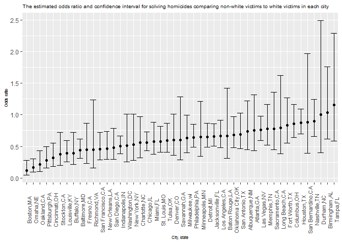
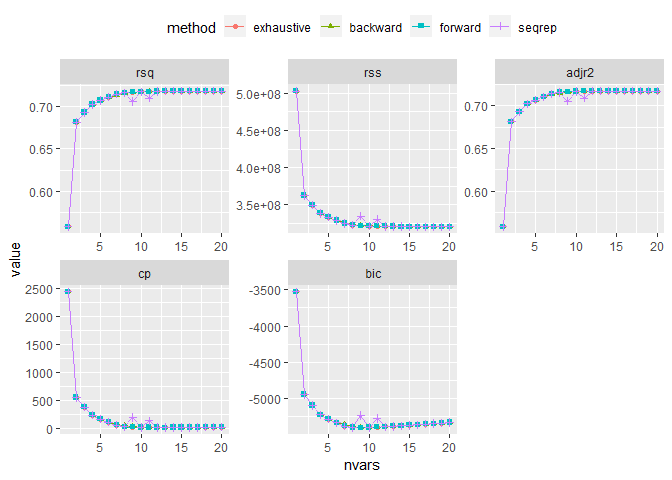
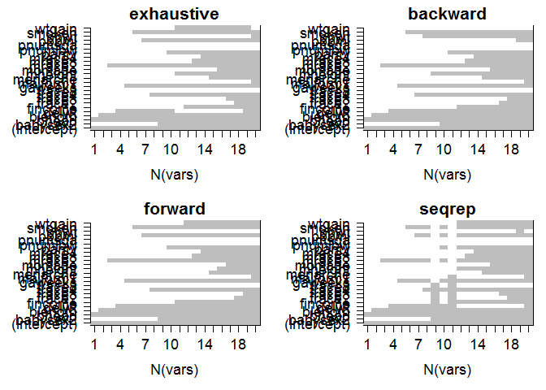
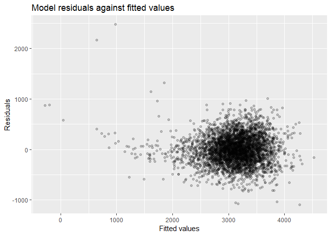
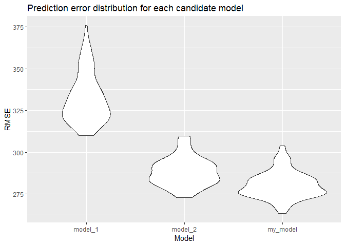

p8105\_hw6\_hx2264
================
Hongyao Xie
November 20, 2018

Problem 1
---------

    ## -- Attaching packages -------------------- tidyverse 1.2.1 --

    ## v ggplot2 3.0.0     v purrr   0.2.5
    ## v tibble  1.4.2     v dplyr   0.7.7
    ## v tidyr   0.8.1     v stringr 1.3.1
    ## v readr   1.1.1     v forcats 0.3.0

    ## -- Conflicts ----------------------- tidyverse_conflicts() --
    ## x dplyr::filter() masks stats::filter()
    ## x dplyr::lag()    masks stats::lag()

    ## 
    ## Attaching package: 'gridExtra'

    ## The following object is masked from 'package:dplyr':
    ## 
    ##     combine

    ## Loading required package: lattice

    ## Loading required package: grid

    ## Loading required package: latticeExtra

    ## Loading required package: RColorBrewer

    ## 
    ## Attaching package: 'latticeExtra'

    ## The following object is masked from 'package:ggplot2':
    ## 
    ##     layer

    ## Loading required package: multcomp

    ## Loading required package: mvtnorm

    ## Loading required package: survival

    ## Loading required package: TH.data

    ## Loading required package: MASS

    ## 
    ## Attaching package: 'MASS'

    ## The following object is masked from 'package:dplyr':
    ## 
    ##     select

    ## 
    ## Attaching package: 'TH.data'

    ## The following object is masked from 'package:MASS':
    ## 
    ##     geyser

    ## 
    ## Attaching package: 'HH'

    ## The following object is masked from 'package:purrr':
    ## 
    ##     transpose

    ## Loading required package: Matrix

    ## 
    ## Attaching package: 'Matrix'

    ## The following object is masked from 'package:tidyr':
    ## 
    ##     expand

    ## Loading required package: foreach

    ## 
    ## Attaching package: 'foreach'

    ## The following objects are masked from 'package:purrr':
    ## 
    ##     accumulate, when

    ## Loaded glmnet 2.0-16

**Create a city\_state variable (e.g. “Baltimore, MD”), and a binary variable indicating whether the homicide is solved.**

``` r
# Create a city_state variable
homic <-  read_csv("./data/homicide-data.csv") %>% 
  janitor::clean_names() %>% 
  mutate(city_state = paste(city, state, sep = ",")) 
```

    ## Parsed with column specification:
    ## cols(
    ##   uid = col_character(),
    ##   reported_date = col_integer(),
    ##   victim_last = col_character(),
    ##   victim_first = col_character(),
    ##   victim_race = col_character(),
    ##   victim_age = col_character(),
    ##   victim_sex = col_character(),
    ##   city = col_character(),
    ##   state = col_character(),
    ##   lat = col_double(),
    ##   lon = col_double(),
    ##   disposition = col_character()
    ## )

``` r
# Create a binary variable
homic$hmc_resolve <- ifelse(homic$disposition == "Closed by arrest", 1, 0)
```

**Omit cities Dallas, TX; Phoenix, AZ; Kansas City, MO; and Tulsa, AL. Modifiy victim\_race to have categories white and non-white, with white as the reference category. Be sure that victim\_age is numeric.**

``` r
homic <- homic %>% 
  filter(!city_state %in% c("Dallas,TX","Phoenix,AZ", "Kansas City,MO", "Tulsa,AL")) %>%
  filter(victim_race != "Unknown") %>% 
  mutate(victim_race = fct_relevel(ifelse(victim_race == "White", "white", "non-white"), "white")) %>%
  mutate(victim_age = as.numeric(victim_age))
```

    ## Warning in evalq(as.numeric(victim_age), <environment>): NAs introduced by
    ## coercion

**For the city of Baltimore, MD, use the glm function to fit a logistic regression with resolved vs unresolved as the outcome and victim age, sex and race (as just defined) as predictors. Save the output of glm as an R object; apply the broom::tidy to this object**

``` r
baltm <- homic %>% 
  filter(city_state == "Baltimore,MD")

baltm_glm <- glm(hmc_resolve ~ victim_age + victim_sex + victim_race, data = baltm, family = binomial()) %>% 
  broom::tidy()
baltm_glm
```

    ## # A tibble: 4 x 5
    ##   term                 estimate std.error statistic  p.value
    ##   <chr>                   <dbl>     <dbl>     <dbl>    <dbl>
    ## 1 (Intercept)           1.19      0.235        5.06 4.30e- 7
    ## 2 victim_age           -0.00699   0.00326     -2.14 3.22e- 2
    ## 3 victim_sexMale       -0.888     0.136       -6.53 6.80e-11
    ## 4 victim_racenon-white -0.820     0.175       -4.69 2.68e- 6

**Obtain the estimate and confidence interval of the adjusted odds ratio for solving homicides comparing non-white victims to white victims keeping all other variables fixed**

``` r
baltm_glm <- baltm_glm %>% 
  mutate(or = exp(estimate),
         confint_low = exp(estimate - std.error*1.96),
         confint_up = exp(estimate + std.error*1.96)) %>% 
  dplyr::select(term, estimate, or, confint_low, confint_up) %>% 
  knitr::kable(digits = 2)
baltm_glm
```

| term                  |  estimate|    or|  confint\_low|  confint\_up|
|:----------------------|---------:|-----:|-------------:|------------:|
| (Intercept)           |      1.19|  3.27|          2.07|         5.19|
| victim\_age           |     -0.01|  0.99|          0.99|         1.00|
| victim\_sexMale       |     -0.89|  0.41|          0.32|         0.54|
| victim\_racenon-white |     -0.82|  0.44|          0.31|         0.62|

The adjusted odds ratio for solving homicides comparing non-white victims to white victims 0.44, which indicates the odds of solving homicides with non-white victims is 0.44 times the odds of solving homicides with white victims.

The 95% confidence interval is (0.31, 0.62), which means we are 95% confident that the true odds ratio falls in this interval.

**Run glm for each of the cities in your dataset, and extract the adjusted odds ratio (and CI) for solving homicides comparing non-white victims to white victims**

``` r
homic_city <- homic %>% 
  group_by(city_state) %>% 
  nest()

homic_city$glm_model <- map(homic_city$data, ~broom::tidy(glm(hmc_resolve ~ victim_age + victim_sex + victim_race, data = .x, family = binomial()))) 

homic_city <- homic_city %>% 
  dplyr::select(city_state, glm_model) %>% 
  unnest() %>%
  filter(term == "victim_racenon-white") %>% 
  mutate(or = exp(estimate),
         confint_low = exp(estimate - std.error*1.96),
         confint_up = exp(estimate + std.error*1.96)) %>% 
  dplyr::select(city_state, term, estimate, or, confint_low, confint_up)
homic_city
```

    ## # A tibble: 47 x 6
    ##    city_state     term               estimate    or confint_low confint_up
    ##    <chr>          <chr>                 <dbl> <dbl>       <dbl>      <dbl>
    ##  1 Albuquerque,NM victim_racenon-wh~  -0.302  0.739      0.447       1.22 
    ##  2 Atlanta,GA     victim_racenon-wh~  -0.284  0.753      0.432       1.31 
    ##  3 Baltimore,MD   victim_racenon-wh~  -0.820  0.441      0.313       0.620
    ##  4 Baton Rouge,LA victim_racenon-wh~  -0.404  0.668      0.313       1.43 
    ##  5 Birmingham,AL  victim_racenon-wh~   0.0385 1.04       0.615       1.76 
    ##  6 Boston,MA      victim_racenon-wh~  -2.15   0.116      0.0480      0.282
    ##  7 Buffalo,NY     victim_racenon-wh~  -0.936  0.392      0.214       0.719
    ##  8 Charlotte,NC   victim_racenon-wh~  -0.584  0.558      0.321       0.969
    ##  9 Chicago,IL     victim_racenon-wh~  -0.576  0.562      0.431       0.733
    ## 10 Cincinnati,OH  victim_racenon-wh~  -1.14   0.318      0.184       0.551
    ## # ... with 37 more rows

**Create a plot that shows the estimated ORs and CIs for each city. Organize cities according to estimated OR, and comment on the plot**

``` r
homic_city_plot <- homic_city %>%
  mutate(city_state = fct_reorder(city_state, or)) %>% 
  ggplot(aes(x = city_state, y = or)) +
  geom_point() +
  geom_errorbar(mapping = aes(ymin = confint_low, ymax = confint_up)) + 
  labs(
    title = "The estimated odds ratio and confidence interval for solving homicides comparing non-white victims to white victims in each city",
    x = "City, state",
    y = "Odds ratio"
  ) +
  theme(axis.text.x = element_text(angle = 90, size = 8),
        title = element_text(size = 6)) 

homic_city_plot
```



Most cities have estimated odds ratio below 1, which implies in most cities the odds of solving homicides with non-white victims is lower than the odds of solving homicides with white victims.

Problem 2
---------

``` r
# Load data and clean up NAs, convert some variables from numeric to factor
bw <- read_csv("./data/birthweight.csv") %>% 
  janitor::clean_names() %>% 
  na.omit() %>% 
  mutate(babysex = as.factor(babysex),
         frace = as.factor(frace),
         malform = as.factor(malform),
         mrace = as.factor(mrace))
```

    ## Parsed with column specification:
    ## cols(
    ##   .default = col_integer(),
    ##   gaweeks = col_double(),
    ##   ppbmi = col_double(),
    ##   smoken = col_double()
    ## )

    ## See spec(...) for full column specifications.

**Propose a regression model for birthweight.**

``` r
# A function to compare some criterias for model size selection and variable membership
# Use exhaustive/backward/forward/sequential replacement methods to choose optimal model size
summary_metrics <- NULL
which_all <- list()
for (my_mthd in c("exhaustive", "backward", "forward", "seqrep") ) {
  rs_res <- regsubsets(bwt ~ .,bw,method = my_mthd,nvmax = 19)
  summ_res <- summary(rs_res)
  which_all[[my_mthd]] <- summ_res$which
  for (metric_name in c("rsq","rss","adjr2","cp","bic") ) {
    summary_metrics <- rbind(summary_metrics,
      data.frame(method = my_mthd,metric = metric_name,
                nvars = 1:length(summ_res[[metric_name]]),
                value = summ_res[[metric_name]]))
  }
}
```

    ## Warning in leaps.setup(x, y, wt = wt, nbest = nbest, nvmax = nvmax,
    ## force.in = force.in, : 3 linear dependencies found

    ## Reordering variables and trying again:

    ## Warning in leaps.setup(x, y, wt = wt, nbest = nbest, nvmax = nvmax,
    ## force.in = force.in, : 3 linear dependencies found

    ## Reordering variables and trying again:

    ## Warning in leaps.setup(x, y, wt = wt, nbest = nbest, nvmax = nvmax,
    ## force.in = force.in, : 3 linear dependencies found

    ## Reordering variables and trying again:

    ## Warning in leaps.setup(x, y, wt = wt, nbest = nbest, nvmax = nvmax,
    ## force.in = force.in, : 3 linear dependencies found

    ## Reordering variables and trying again:

``` r
# Plot R-square/adjusted R-square/RSS/Cp/BIC value to choose optimal model size
ggplot(summary_metrics,aes(x = nvars,y = value,shape = method, colour = method)) + 
  geom_path() + 
  geom_point() + 
  facet_wrap(~ metric,scales = "free") +   
  theme(legend.position = "top")
```



``` r
old.par <- par(mfrow = c(2,2),ps = 16,mar = c(5,7,2,1))

# Plot variable memberships for each model selection method
for (my_mthd in names(which_all) ) {
  image(1:nrow(which_all[[my_mthd]]),
        1:ncol(which_all[[my_mthd]]),
        which_all[[my_mthd]],xlab = "N(vars)",ylab = "",
        xaxt = "n",yaxt = "n",breaks = c(-0.5,0.5,1.5),
        col = c("white","gray"),main = my_mthd)
  axis(1,1:nrow(which_all[[my_mthd]]),rownames(which_all[[my_mthd]]))
  axis(2,1:ncol(which_all[[my_mthd]]),colnames(which_all[[my_mthd]]),las = 2)
}
```



**Describe your modeling process.**

Here I used regsubsets function from leaps packages. This function selected models by exhaustive search, forward or backward stepwise, or sequential replacement once specified. I selected out R-square/adjusted R-square/RSS/Cp/BIC values for each model size and made ggplot to visualize the values. After visualization, we can see when variables are 8, the model tends to be "optimal" (to achieve bias/variance balance).

Then we want to know which 8 variables were selected by the four methods from regsubsets function. I used image function to create a grid of rectagle plots to indicate whether each variable was included or not. After all these steps, we can see the variable memberships for each method.

Finally, we chose smoken, ppbmi, gaweeks, delwt, blength, bhead for our model. Although we see specific mother race and father race (mrace = 2 and frace = 4) also had significant influence on birth weight from model selection process, we did not include these two variables here, since other levels of mrace and frace didn't show significant differences (but we can surely stratify these two variables to fit the model).

``` r
# Final model: variable = 6, including smoken, ppbmi, gaweeks, delwt, blength, bhead
bw_lm <- lm(bwt ~ smoken + ppbmi + gaweeks + delwt + blength + bhead, data = bw)
summary(bw_lm)
```

    ## 
    ## Call:
    ## lm(formula = bwt ~ smoken + ppbmi + gaweeks + delwt + blength + 
    ##     bhead, data = bw)
    ## 
    ## Residuals:
    ##     Min      1Q  Median      3Q     Max 
    ## -1089.6  -184.9    -7.4   175.7  2475.8 
    ## 
    ## Coefficients:
    ##               Estimate Std. Error t value Pr(>|t|)    
    ## (Intercept) -6040.1713    98.1282 -61.554  < 2e-16 ***
    ## smoken         -2.4725     0.5797  -4.265 2.04e-05 ***
    ## ppbmi         -14.2631     1.9528  -7.304 3.31e-13 ***
    ## gaweeks        14.1347     1.4849   9.519  < 2e-16 ***
    ## delwt           3.6181     0.2882  12.554  < 2e-16 ***
    ## blength        77.3336     2.0699  37.361  < 2e-16 ***
    ## bhead         134.9480     3.4781  38.799  < 2e-16 ***
    ## ---
    ## Signif. codes:  0 '***' 0.001 '**' 0.01 '*' 0.05 '.' 0.1 ' ' 1
    ## 
    ## Residual standard error: 280.6 on 4335 degrees of freedom
    ## Multiple R-squared:  0.7002, Adjusted R-squared:  0.6998 
    ## F-statistic:  1687 on 6 and 4335 DF,  p-value: < 2.2e-16

**Show a plot of model residuals against fitted values – use add\_predictions and add\_residuals in making this plot**

``` r
bw %>% 
  add_residuals(bw_lm) %>% 
  add_predictions(bw_lm) %>% 
  ggplot(aes(x = pred, y = resid)) + 
  geom_point(alpha = 0.2) +
  labs(
     title = "Model residuals against fitted values",
     x = "Fitted values",
     y = "Residuals"
   )
```



**Compare your model to two others**

``` r
# One using length at birth and gestational age as predictors (main effects only)
bw_model1 <- lm(bwt ~ blength + gaweeks, data = bw)
summary(bw_model1)
```

    ## 
    ## Call:
    ## lm(formula = bwt ~ blength + gaweeks, data = bw)
    ## 
    ## Residuals:
    ##     Min      1Q  Median      3Q     Max 
    ## -1709.6  -215.4   -11.4   208.2  4188.8 
    ## 
    ## Coefficients:
    ##              Estimate Std. Error t value Pr(>|t|)    
    ## (Intercept) -4347.667     97.958  -44.38   <2e-16 ***
    ## blength       128.556      1.990   64.60   <2e-16 ***
    ## gaweeks        27.047      1.718   15.74   <2e-16 ***
    ## ---
    ## Signif. codes:  0 '***' 0.001 '**' 0.01 '*' 0.05 '.' 0.1 ' ' 1
    ## 
    ## Residual standard error: 333.2 on 4339 degrees of freedom
    ## Multiple R-squared:  0.5769, Adjusted R-squared:  0.5767 
    ## F-statistic:  2958 on 2 and 4339 DF,  p-value: < 2.2e-16

``` r
# One using head circumference, length, sex, and all interactions (including the three-way interaction) between these
bw_model2 <- lm(bwt ~ bhead + blength + babysex + bhead*babysex + bhead*blength + blength*babysex + bhead*babysex*blength, data = bw)
summary(bw_model2)
```

    ## 
    ## Call:
    ## lm(formula = bwt ~ bhead + blength + babysex + bhead * babysex + 
    ##     bhead * blength + blength * babysex + bhead * babysex * blength, 
    ##     data = bw)
    ## 
    ## Residuals:
    ##      Min       1Q   Median       3Q      Max 
    ## -1132.99  -190.42   -10.33   178.63  2617.96 
    ## 
    ## Coefficients:
    ##                          Estimate Std. Error t value Pr(>|t|)    
    ## (Intercept)            -7176.8170  1264.8397  -5.674 1.49e-08 ***
    ## bhead                    181.7956    38.0542   4.777 1.84e-06 ***
    ## blength                  102.1269    26.2118   3.896 9.92e-05 ***
    ## babysex2                6374.8684  1677.7669   3.800 0.000147 ***
    ## bhead:babysex2          -198.3932    51.0917  -3.883 0.000105 ***
    ## bhead:blength             -0.5536     0.7802  -0.710 0.478012    
    ## blength:babysex2        -123.7729    35.1185  -3.524 0.000429 ***
    ## bhead:blength:babysex2     3.8781     1.0566   3.670 0.000245 ***
    ## ---
    ## Signif. codes:  0 '***' 0.001 '**' 0.01 '*' 0.05 '.' 0.1 ' ' 1
    ## 
    ## Residual standard error: 287.7 on 4334 degrees of freedom
    ## Multiple R-squared:  0.6849, Adjusted R-squared:  0.6844 
    ## F-statistic:  1346 on 7 and 4334 DF,  p-value: < 2.2e-16

**Make this comparison in terms of the cross-validated prediction error**

``` r
bw_cv <- bw %>% 
  crossv_mc(100)

cv_models_compare <- 
  bw_cv %>% 
   mutate(my_model = map(train, ~lm(bwt ~ smoken + ppbmi + gaweeks + delwt + blength + bhead, data = .)),
         model_1 = map(train, ~lm(bwt ~ blength + gaweeks, data = .)),
         model_2 = map(train, ~lm(bwt ~ bhead + blength + babysex + bhead*babysex + bhead*blength + blength*babysex + bhead*babysex*blength, data = .)))%>% 
   mutate(rmse_my_model = map2_dbl(my_model, test, ~rmse(.x, .y)),
         rmse_model_1 = map2_dbl(model_1, test, ~rmse(.x, .y)),
         rmse_model_2 = map2_dbl(model_2, test, ~rmse(.x, .y)))

cv_models_compare %>% 
  dplyr::select(starts_with('rmse')) %>% 
  gather(key = model, value = rmse, rmse_my_model:rmse_model_2) %>% 
  mutate(model = str_replace(model, "rmse_", '')) %>% 
  ggplot(aes(x = model, y = rmse)) +
  geom_violin() + 
  labs(
     title = "Prediction error distribution for each candidate model",
     x = "Model",
     y = "RMSE"
   )
```



As we can see from the violin plot, my model has the lowest RMSE and the model 1 has the highest RMSE, which implies my model and model 2 do a better job regarding prediction accuracy than model 1. This makes sense because model 1 only includes two variables(length at birth and gestational age) to predict birth weight, which does not consider other factors that have significant effect on birth weight as well.
